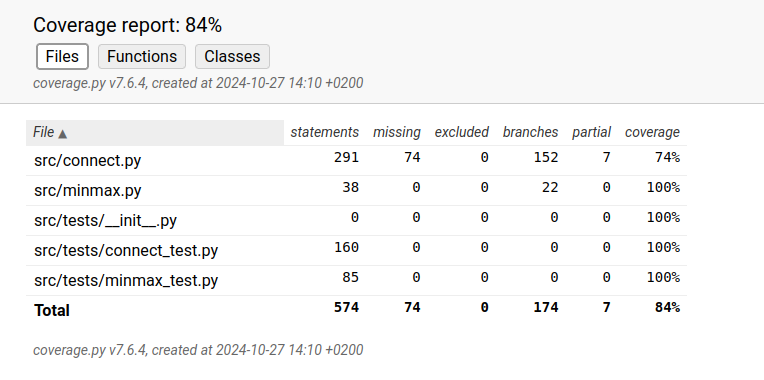

# Testausdokumentti

## Testien ajo

Testit voidaan ajaa terminaalista ensin menemällä projektin juurikansioon ja ajamalla komento 

```bash
poetry shell
```
ja sen jälkeen komento 

```bash
pytest src
```

Testikattavuuden saa ajamalla komennon

```bash
coverage run --branch -m pytest src
```

ja komennon 
```bash
coverage report -m
```

## Ulkopuolelle jätetyt testit ja testikattavuus

ui_start ja playing_stage funktioita ei ole testattu näiden hoitaessa käyttöliittymää. Myöskään print_board funktiota ei ole yksikkötestattu.

Kun minmax funktion syvyydeksi on asetettu 2, se läpäisee kaikki paitsi yhden testin, kun syvyys on 4 se läpäisee kaikki paitsi kolme ja jos syvyys on 6 se läpäisee kaikki paitsi neljä testiä. Syvyydellä 6 ja suuremmilla koodi toimii hitaasti. 

Testikattavuus on laskettu syvyydellä 4.



## Testien selitykset


### connect.py testit


#### possible_columns tests

test_possible_columns_all:
Testaa että possible_columns funktio palauttaa oikean listan mahdollisia siirtoja, kun sille annetaan tyhjä pelilauta.

test_possible_columns_some:
Testaa että possible_columns funktio palauttaa oikean listan mahdollisia siirtoja, kun sille annetaan pelilauta, jossa kaikki siirrot eivät mahdollisia.

test_possible_columns_none:
Testaa että possible_columns funktio palauttaa tyhjän listan mahdollisia siirtoja, kun sille annetaan pelilauta, jossa siirrot eivät mahdollisia.


#### drop_piece tests

test_drop_piece:
Testaa, että pelilauta muuttuu kun sille annetaan mahdollinen siirto.

test_drop_piece_false
Testaa, että pelilauta ei muutu kun sille annetaan mahdoton siirto.

#### check_full tests

test_check_full:
Testaa, että pelilauta on täynnä (testattava funktio tarkastaa vain ylimmän rivin, joten testattava pelilauta ei tässä tapauksessa tarvi olla oikeellinen/kokonaan täynnä)

test_check_full_false:
Testaa, että pelilauta ei ole täynnä.

#### check_top tests

test_check_top_top:
Testaa, että annetun laudan ja sarakkeen ylin rivi on -6.

test_check_top_bottom:
Testaa, että annetun laudan ja sarakkeen ylin rivi on alin rivi 0.

#### check_winner tests

check_winner testejä on paljon ja ne voivat vaikuttaa toisteiselta, mutta voittajantarkistus funktion kanssa oli niin paljon ongelmia, minkä takia vähän toisistaan eroavia testejä on niin paljon. Voittorivin sijainnin muuttuessa, osa testeistä saattoi mennä läpi ja osa ei, vaikka funktion olisi pitänyt tunnistaa molemmat tilanteet samaksi.

test_vertical_check:
Testaa ensin, että voittoriviä ei löydy kun pystysuora on 3 merkkiä pitkä ja sitten, että voittorivi löytyy kun pystysuora on 4 merkkiä pitkä.

test_vertical_check_top:
Testaa, että voittorivi löytyy, kun pystysuora alkaa laudan yläriviltä.

test_horizontal_check_down:
Testaa ensin, että voittorivi löytyy kun 4 merkkiä vaakatasossa alarivillä vasemmalla. Testaa sitten, että voittoriviä ei löydy kun 4:n suoraa ei ole.
Testaa sekä check_winner_horizontal_left, että check_winner_horizontal_right toimivuutta.

test_horizontal_check_top:
Testaa ensin, että voittorivi löytyy kun 4 merkkiä vaakatasossa ylärivillä oikealla. Testaa sitten, että voittoriviä ei löydy kun 4:n suoraa ei ole.
Testaa sekä check_winner_horizontal_left, että check_winner_horizontal_right toimivuutta.

test_diagonal_check_down_1:
Testaa ensin, että diagonaali 4:n suora löytyy alhaalta ylöspäin ja että suoraa ei löydy kun 4:n suoraa ei ole.
Testaa sekä check_winner_up_right, että check_winner_down_left toimivuutta.

test_diagonal_check_down_2:
Testaa ensin, että diagonaali 4:n suora löytyy ylhäältä alaspäin ja että suoraa ei löydy kun 4:n suoraa ei ole.
Testaa sekä check_winner_up_left, että check_winner_down_right toimivuutta.

test_diagonal_check_up_1:
Testaa ensin, että diagonaali 4:n suora löytyy ylhäältä alaspäin ja että suoraa ei löydy kun 4:n suoraa ei ole. Muuten sama kuin edellinen, mutta diagonaali nyt yläkulmassa.
Testaa sekä check_winner_up_left, että check_winner_down_right toimivuutta.

test_diagonal_check_up_2:
Testaa ensin, että diagonaali 4:n suora löytyy alhaalta ylöspäin ja että suoraa ei löydy kun 4:n suoraa ei ole. Muuten sama kuin aiemmin, mutta diagonaali nyt yläkulmassa.
Testaa sekä check_winner_up_right, että check_winner_down_left toimivuutta.

test_full_check_winner:
Testaa koko check_winner funktion toimivuutta, että palauttaa True kun annetulta laudalta löytyy voittaja viime siirron kohdalta.

test_full_check_no_winner:
Testaa koko check_winner funktion toimivuutta, että palauttaa False kun voittajaa ei ole.

### score_position tests

test_score_position:
Testaa, että score_position palauttaa varman häviön arvon (-inf).

test_score_position_2:
Testaa, että score_position palauttaa varman voiton arvon (inf).

### evaluate tests

test_evaluate:
Testaa, että tyhjä rivi palauttaa arvoksi 0.

test_evaluate_win_left:
Testaa, että vasemman reunan 4:n suoran pisteytys toimii.

test_evaluate_win_right:
Testaa, että oikean reunan 4:n suoran pisteytys toimii.

test_evaluate_gap:
Testaa, että tyhjän kohdan pisteytys on sama riippumatta missä kohtaa riviä se on, kun yhdellä siirrolla saataisiin suora.

##### Nämä kaksi vikaa testiä on vain osoittamaan heuristiikan puutteellisuus, eivätkä ne nykyisellä koodilla mene läpi. 

test_evaluate_dif:
Testaa, että kahden merkin rivien pisteytys on eri. Eli koska ekana annettulla rivillä on tyhjää tilaa vain oikealla, sen pisteytys pitäisi olla matalampi kuin toisena annettulla rivillä, koska siinä on tyhjää oikealla ja vasemmalla puolella.

test_evaluate_dif:2:
Testaa, että kahden merkin rivien pisteytys on eri. Eli koska ekana annettulla rivillä on tyhjää tilaa vain oikealla, sen pisteytys pitäisi olla matalampi kuin toisena annettulla rivillä, koska siinä on tyhjää oikealla ja vasemmalla puolella.


### minmax.py testit

Minmax testeissä on testattu lähinnä suoraan blokkaavaa tai voittoon tähtäävää liikettä. Testien "oikeat" vastaukset joihin tuloksia verrataan, pitäisi olla yksiselittäiset.
Testeissä on jonkin verran toisteisuutta, koska koodia tehdessä testit antoivat eri tuloksia, riippuen kummassa nurkassa "pelitilanne" oli, vaikka olisi pitänyt antaa samat.

test_best_start_next_move:
Testaa, että minmax palauttaa siirron on keskimmäiseen sarakkeeseen. Tämä on tunnetusti paras mahdollinen aloitussiirto.

test_block_vertical:
Testaa, että minmax blokkaa pystysuoran rivin.

test_block_horizontal:
Testaa, että minmax blokkaa vaakasuoran rivin.

test_block_diagonal_right:
Testaa, että minmax blokkaa diagonaalin rivin, vasen kulma.

test_block_diagonal_left:
Testaa, että minmax blokkaa diagonaalin rivin, oikea kulma.

test_winning_move_vertical:
Testaa, että voittoliike tehdää pystysuoraan.

test_winning_move_horizontal:
Testaa, että voittoliike tehdää vaakasuoraan.

test_winning_move_diagonal_right:
Testaa, että voittoliike tehdään diagonaaliin, vasen kulma.

test_winning_move_diagonal_left:
Testaa, että voittoliike tehdään diagonaaliin, oikea kulma.

test_winning_move_before_opponent ja test_winning_move_before_opponent_2:
Koodissa oli yhdessä vaiheessa ongelma, jossa voittosiirron sijaan blokattiin vastustaja, jos vastustajan rivi oli lähempänä vasempaa reunaa. 
Nämä testaavat, että eroa siirrossa ei enää tehdä sen perusteella, että voittajan 3:n suora löytyi ennen omaa.

test_board_full:
Testaa, että lauta on täynnä ja voittajaa ei ollut.

#### Loput testit ovat enemmän oikeita pelitilanne testejä

test_blocking_win_situation:
Testaa, että kyseinen sarake blokataan. Ollut tilanne, missä ei blokattu.

test_block_situation:
Testaa, että kyseinen sarake blokataan, muuten vastustajalla melko varma voitto muutaman siirron päästä (jos vastutaja laittaa merkin sarakkeeseen, 2 neljän suoran mahdollisuutta, joista voidaan blokata vain yksi).

test_losing_move_situation ja test_losing_move_situation_2
Testaa, että ei laitettaisi merkkiä sarakkeeseen, joka johtaa vastustajan voittoon. Kuitenkin tällainen liike tehtiin jollain heuristiikka arvoilla ensimmäisessä tilanteessa. situation_2:ssa muutettu kolmanneksi alimman rivin keskisarakkeen kakkonen ykköseksi. Tämän johtaa siihen, ettei yritetä siirtoa sarakkeeseen, missä vastustajan voitto varma. Ilmeisesti vastustajan mahdollisen voittorivin yläpuolella oleva mahdollisuus omaan voittoriviin, saa ensimmäisessä tilanteessa tekemään huonon päätöksen.

#### Ei läpi menneet testit

Esittämässä, että minmax algoritmin toiminta ei täysin järkevää vieläkään.

test_winning_move_situation ja test_winning_move_situation_2:
Testaa, että voittoliike tehtäisiin. Syystä x ensimmäinen tilanne ei tee sitä. situation_2 missä blokattu alaoikea ykkösellä, taas johtaa voittoliikkeen tekemiseen.
Ilmeisesti diagonaalin suoran luominen mielekkäämpää, vaikka voitto mahdollinen ensimmäisessä tilanteessa.

test_block_win_situation ja test_block_win_situation_2:
Testataan, että pelitilanteessa, missä vastustajalla 3:n suora ja itsellä 3:n suora, tehtäisiin voittoliike. Sen sijaan, että tehtäisiin voittoliike tai edes blokattaisiin vastustaja,
tehdään siirto muualle. situation_2:ssa vaihdetaan keskisarakkeen ylimmän kakkosen tilalle 0 ja tadaa, voittosiirto tehdään. Ensimmäisessä tilanteessa voittamisen sijaan tai blokkaamisen sijaan näemmä taas tärkeämpää luoda uutta 3:n suoraa keskiriviin.